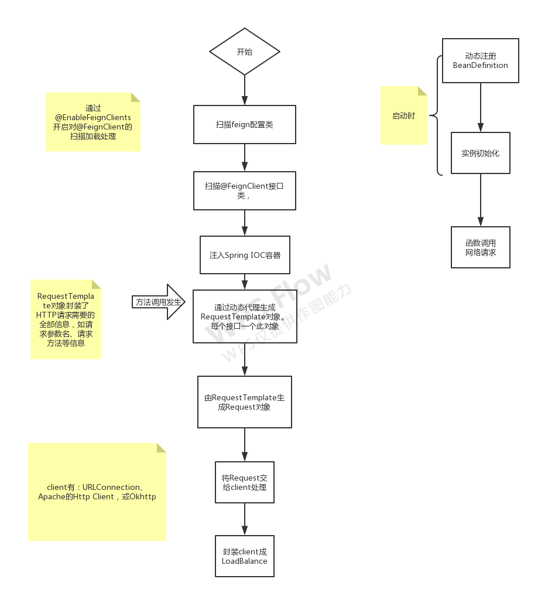

## fein原理

### 启动
`@EnableFeignClients` 在应用启动时，扫描 `@FeignClient` 的类，设置 bean 定义，以及实例化工厂 Bean是 `FeignClientFactoryBean`

### 实例化
在实例化时， `FeignClientFactoryBean` 依据配置， 加载 `FeignContext`， 使用动态代理，封装包含方法的元数据的 `InvocationHandler`

### 调用
在调用时，`feign.SynchronousMethodHandler`, 构建`RequestTemplate`，塞入请求参数，包装为 request, 交由 负载均衡 client （`ribbon`），找到一个服务节点，然后由(HTTP Client)去发起网络调用。

