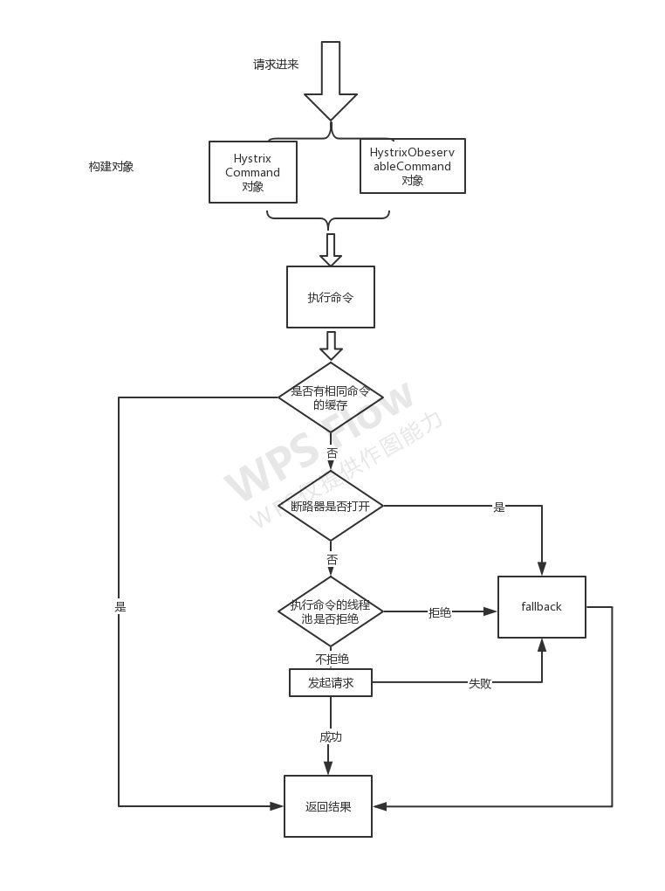

## hystrix原理
通过动态代理 或 AOP, 封装请求为 `HystrixCommand` ，然后判定是否有缓存，如果没有缓存打开，标记统计信息，判定是否熔断器打开。
（1）如果打开，直接走 `Fallback` 或 `FallbackFactory` 逻辑。
（2）如果没有打开，加入线程队列。
    （2-1）如果发生拒绝，走 `Fallback` 或 `FallbackFactory` 逻辑。
    （2-2）如果没有拒绝，执行代理的方法逻辑，执行真正的调用，如果成功返回结果。
    （2-3）如果不可用，则 走 `Fallback` 或 `FallbackFactory` 逻辑。



## 开关例子

```java
/**
 * 只需简单继承`HystrixCommand/HystrixObservableCommand`并重写`run()/construct()`，
 * <p>
 * 然后调用程序实例化此class并执行`execute()/queue()/observe()/toObservable()`
 *
 * @author yueyi2019
 */
public class HelloWorldHystrixCommand2 extends HystrixCommand<String> {

    private final String name;

    public HelloWorldHystrixCommand2(String name) {
        super(Setter.withGroupKey(HystrixCommandGroupKey.Factory.asKey("ExampleGroup"))
                    .andCommandPropertiesDefaults(
                            HystrixCommandProperties.Setter()
                                                    // 错误率超过5%
                                                    .withCircuitBreakerErrorThresholdPercentage(5)
                                                    // 10秒以内超过9次
                                                    .withCircuitBreakerRequestVolumeThreshold(9)
                                                    // 隔5s之后，熔断器会尝试半开(关闭)，重新放进来请求
                                                    .withCircuitBreakerSleepWindowInMilliseconds(5000)
                    ));
        this.name = name;
    }

    /*
     * 如果继承的是HystrixObservableCommand，要重写Observable construct()，
     *  具体业务逻辑
     */
    @Override
    protected String run() {
        Random rand = new Random();
        // 模拟50% 错误率
        if (1 == rand.nextInt(2)) {
            int i = 1 / 0;
        }
        return "正常调用 Hello " + name;
    }

    /**
     * 降级方法
     */
    @Override
    protected String getFallback() {
        return "熔断：fallback,name:" + name;
    }

    public static void main(String[] args) throws InterruptedException {
        /*
         * 这个例子，休眠半秒，一共执行15秒。
         * 10秒以内超过9次请求失败，才开始计算 是否要熔断。
         * 然后 判断 失败率，是否超过5%。
         * 熔断后，
         * 5秒，是 熔断开关打开，直接返回的。
         * 再后来，放一部分请求过去。
         */
        for (int i = 0; i < 30; i++) {
            Thread.sleep(500);
            HystrixCommand<String> command = new HelloWorldHystrixCommand2("testCircuitBreaker");
            String result = command.execute();
            // 本例子中从第10次，熔断器开始打开
            System.out.println("调用次数:" + (i + 1) + "   结果:" + result + " 开关是否打开: " + command.isCircuitBreakerOpen());
            // 本例子中5s以后，熔断器尝试关闭，放开新的请求进来
        }

    }
} 
```

```sh
调用次数:1   结果:熔断：fallback,name:testCircuitBreaker 开关是否打开: false
调用次数:2   结果:熔断：fallback,name:testCircuitBreaker 开关是否打开: false
调用次数:3   结果:熔断：fallback,name:testCircuitBreaker 开关是否打开: false
调用次数:4   结果:熔断：fallback,name:testCircuitBreaker 开关是否打开: false
调用次数:5   结果:正常调用 Hello testCircuitBreaker 开关是否打开: false
调用次数:6   结果:正常调用 Hello testCircuitBreaker 开关是否打开: false
调用次数:7   结果:熔断：fallback,name:testCircuitBreaker 开关是否打开: false
调用次数:8   结果:熔断：fallback,name:testCircuitBreaker 开关是否打开: false
调用次数:9   结果:熔断：fallback,name:testCircuitBreaker 开关是否打开: false
调用次数:10   结果:熔断：fallback,name:testCircuitBreaker 开关是否打开: true
调用次数:11   结果:熔断：fallback,name:testCircuitBreaker 开关是否打开: true
调用次数:12   结果:熔断：fallback,name:testCircuitBreaker 开关是否打开: true
调用次数:13   结果:熔断：fallback,name:testCircuitBreaker 开关是否打开: true
调用次数:14   结果:熔断：fallback,name:testCircuitBreaker 开关是否打开: true
调用次数:15   结果:熔断：fallback,name:testCircuitBreaker 开关是否打开: true
调用次数:16   结果:熔断：fallback,name:testCircuitBreaker 开关是否打开: true
调用次数:17   结果:熔断：fallback,name:testCircuitBreaker 开关是否打开: true
调用次数:18   结果:熔断：fallback,name:testCircuitBreaker 开关是否打开: true
调用次数:19   结果:熔断：fallback,name:testCircuitBreaker 开关是否打开: true
调用次数:20   结果:正常调用 Hello testCircuitBreaker 开关是否打开: false
调用次数:21   结果:正常调用 Hello testCircuitBreaker 开关是否打开: false
调用次数:22   结果:正常调用 Hello testCircuitBreaker 开关是否打开: false
调用次数:23   结果:正常调用 Hello testCircuitBreaker 开关是否打开: false
调用次数:24   结果:熔断：fallback,name:testCircuitBreaker 开关是否打开: false
调用次数:25   结果:熔断：fallback,name:testCircuitBreaker 开关是否打开: false
调用次数:26   结果:正常调用 Hello testCircuitBreaker 开关是否打开: false
调用次数:27   结果:熔断：fallback,name:testCircuitBreaker 开关是否打开: false
调用次数:28   结果:正常调用 Hello testCircuitBreaker 开关是否打开: false
调用次数:29   结果:熔断：fallback,name:testCircuitBreaker 开关是否打开: true
调用次数:30   结果:熔断：fallback,name:testCircuitBreaker 开关是否打开: true
```

细看日志从里面找规律


1. 第10次，熔断开关才打开。之前的 异常 虽然也报错，但是开关没开。（10秒，9次）默认：10秒，20次。
2. 后面有10-19次，总计5秒钟，因为我们设置程序 500毫秒执行。开关一直打开，都走的熔断。（开关打开）
3. 第20次，距离第一次熔断过去了 5秒钟。断路器尝试放开一部分请求过去，正常了就关闭开关。（如果正常，开关关闭，否则，不关闭）
4. 第29次，开关又打开。又到了下一个周期。

