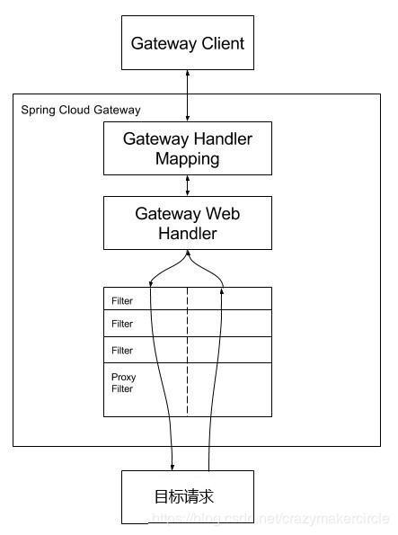

## Spring Cloud Gateway 
- https://spring.io/guides/gs/gateway/
- https://cloud.spring.io/spring-cloud-gateway/reference/html/




### 端点
- 路由端点： http://localhost:9002/actuator/gateway/routes
- 过滤器端点： http://localhost:9002/actuator/gateway/globalfilters
- 过滤器端点： http://localhost:9002/actuator/gateway/routefilters
- 路由条件端点： http://localhost:9002/actuator/gateway/routepredicates

### predicates 路由条件
https://cloud.spring.io/spring-cloud-gateway/reference/html/#gateway-request-predicates-factories

所有这些predicates用于匹配HTTP请求的不同属性

多个 Route Predicate Factories 可以通过逻辑与（and）结合起来一起使用

##### After Route Predicate Factory
```yaml
spring:
  cloud:
    gateway:
      routes:
      - id: after_route
        uri: https://example.org
        predicates:
        - After=2017-01-20T17:42:47.789-07:00[America/Denver]
```
这个路由匹配“美国丹佛时间2017-01-20 17:42”之后的任意请求

##### Header Route Predicate Factory

```yaml
spring:
  cloud:
    gateway:
      routes:
      - id: header_route
        uri: https://example.org
        predicates:
        - Header=X-Request-Id, \d+
```

这个路由匹配“请求头包含X-Request-Id并且其值匹配正则表达式\d+”的任意请求

##### Method Route Predicate Factory
```yaml
spring:
  cloud:
    gateway:
      routes:
      - id: method_route
        uri: https://example.org
        predicates:
        - Method=GET
```

这个路由匹配任意GET请求

##### Path Route Predicate Factory
```yaml
spring:
  cloud:
    gateway:
      routes:
      - id: host_route
        uri: https://example.org
        predicates:
        - Path=/foo/{segment},/bar/{segment}
```

这个路由匹配这样路径的请求，比如：/foo/1 或 /foo/bar 或 /bar/baz

##### Query Route Predicate Factory

这个Predicate有两个参数：一个必须的参数名和一个可选的正则表达式
```yaml
spring:
  cloud:
    gateway:
      routes:
      - id: query_route
        uri: https://example.org
        predicates:
        - Query=baz
```

这个路由匹配“查询参数中包含baz”的请求
```yaml
spring:
  cloud:
    gateway:
      routes:
      - id: query_route
        uri: https://example.org
        predicates:
        - Query=foo, ba.
```

这个路由匹配“查询参数中包含foo，并且其参数值满足正则表达式ba.”的请求，比如：bar，baz

##### RemoteAddr Route Predicate Factory

这个路由接受一个IP（IPv4或IPv6）地址字符串。例如：192.168.0.1/16，其中192.168.0.1，16是子网掩码
```yaml
spring:
  cloud:
    gateway:
      routes:
      - id: remoteaddr_route
        uri: https://example.org
        predicates:
        - RemoteAddr=192.168.1.1/24
```

这里路由匹配远程地址是这样的请求，例如：192.168.1.10

##### The Weight Route Predicate Factory
```yaml
spring:
  cloud:
    gateway:
      routes:
      - id: weight_high
        uri: https://weighthigh.org
        predicates:
        - Weight=group1, 8
      - id: weight_low
        uri: https://weightlow.org
        predicates:
        - Weight=group1, 2
```
这里路由配置，大约80%的流量转发到weighthigh.org网站, 约20%的流量转发到weighlow.org网站

### filters 网关过滤器工厂
https://cloud.spring.io/spring-cloud-gateway/reference/html/#gatewayfilter-factories

- `GatewayFilter`

### 全局过滤器
`GlobalFilter`接口的方法签名和`GatewayFilter`相同。这些是有条件地应用于所有路由的特殊过滤器。

当一个请求过来的时候，将会添加所有的`GatewayFilter`实例和所有特定的`GatewayFilter`实例到过滤器链上。过滤器链按照`org.springframework.core.Ordered`接口对该链路上的过滤器进行排序。你可以通过实现接口中的`getOrder()`方法或者使用`@Order`注解。

Spring Cloud Gateway将过滤器执行逻辑分为`pre`和``post阶段。优先级最高的过滤器将会是`pre`阶段中的第一个过滤器，同时它也将是`post`阶段中的最后一个过滤器。


