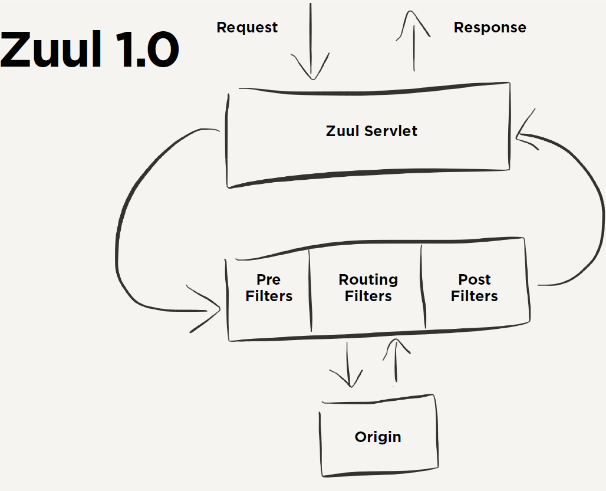

## Zuul
- https://docs.spring.io/spring-cloud-netflix/docs/2.2.5.RELEASE/reference/html/#router-and-filter-zuul



### 端点
```yaml
management:
  endpoints:
    web:
      exposure:
        include: "*"
  endpoint:
    health:
      ##默认是never
      show-details: ALWAYS
      enabled: true
    routes:
      enabled: true
```

* 路由端点： http://localhost:9001/actuator/routes
* 过滤器端点： http://localhost:9001/actuator/filters


#### 过滤器

Zuul的大部分功能都是有过滤器实现的。


4种过滤器

* PRE: 在请求被路由之前调用，可利用这种过滤器实现身份验证。选择微服务，记录日志。

* ROUTING:在将请求路由到微服务调用，用于构建发送给微服务的请求，并用http client（或者ribbon）请求微服务。

* POST:在调用微服务执行后。可用于添加header，记录日志，将响应发给客户端。

* ERROR:在其他阶段发生错误是，走此过滤器。


实现接口 `com.netflix.zuul.ZuulFilter`, 加入spring容器，其中 filterType() 填写过滤器类型。


#### 接口容错

实现接口 `org.springframework.cloud.netflix.zuul.filters.route.FallbackProvider`, 加入spring容器

其中 getRoute() 填写 哪个微服务(服务Id)提供回退 ，若需要所有服务调用都支持回退，返回null 或者 * 即可。

