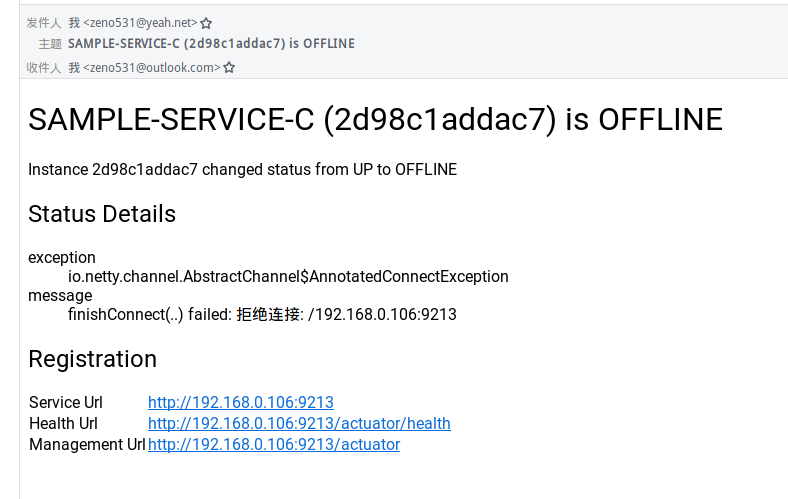

# admin-server


##  健康检查

### 使用

* 1, admin 组件端 (tacing-admin-server模块)
server端：
```xml
    <!-- admin-server -->
    <dependency>
      <groupId>de.codecentric</groupId>
      <artifactId>spring-boot-admin-starter-server</artifactId>
    </dependency>
    <dependency>
      <groupId>de.codecentric</groupId>
      <artifactId>spring-boot-admin-server-ui</artifactId>
    </dependency>
```
```java
@EnableAdminServer
```

* 2， 每个需要监控的服务，都加

pom：
```xml
<dependency>
  <groupId>org.springframework.boot</groupId>
  <artifactId>spring-boot-starter-actuator</artifactId>
</dependency>
```

yml：
```yaml
management:
  endpoints:
    web:
      exposure:
        #yml加双引号，properties不用加
        include: "*" 
    health:
      ##默认是never
      show-details: ALWAYS
      enabled: true   
```

* 3, 访问server

http://localhost:6010/

root/root


小插曲 正六边形算法。


### 邮件监控 (tacing-admin-server模块)

1, pom
```xml
   <dependency>
        <groupId>org.springframework.boot</groupId>
        <artifactId>spring-boot-starter-mail</artifactId>
      </dependency>
```

2, yml
```yaml
   spring: 
     application: 
       name: cloud-admin
     security:
       user:
         name: root
         password: root
     # 邮件设置
     mail:
       host: smtp.qq.com
       username: 单纯QQ号
       password: xxxxxxx授权码
       properties:
         mail: 
           smpt: 
             auth: true
             starttls: 
               enable: true
               required: true
  boot:
    admin:
      notify:
        mail:
          # 收件邮箱
          to: 2634982208@qq.com
          # 发件邮箱
          from: 1399979641@qq.com
```

3, 下线一个服务。

4, 去邮箱查看。

