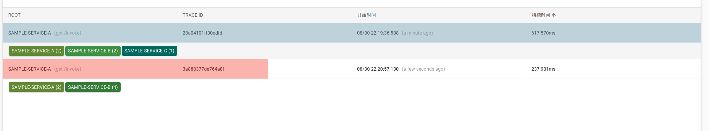

# Sleuth

## Sleuth简介

Sleuth是Spring cloud的分布式跟踪解决方案。

* 1, `span`(跨度)，基本工作单元。一次链路调用，创建一个span，

   span用一个64位id唯一标识。包括：id，描述，时间戳事件，spanId,span父id。

   span被启动和停止时，记录了时间信息，初始化span叫：root span，它的 span id 和 trace id相等。

* 2, `trace`(跟踪)，一组共享“root span”的span组成的树状结构 称为 trace，trace也有一个64位ID，trace中所有span共享一个trace id。类似于一颗 span 树。

* 3, `annotation`（标签），annotation用来记录事件的存在，其中，核心annotation用来定义请求的开始和结束。

   - CS (Client Send客户端发起请求)。客户端发起请求描述了span开始。
   - SR (Server Received服务端接到请求)。服务端获得请求并准备处理它。SR-CS=网络延迟。
   - SS （Server Send服务器端处理完成，并将结果发送给客户端）。表示服务器完成请求处理，响应客户端时。SS-SR=服务器处理请求的时间。
   - CR （Client Received 客户端接受服务端信息）。span结束的标识。客户端接收到服务器的响应。CR-CS=客户端发出请求到服务器响应的总时间。

其实数据结构是一颗树，从root span 开始。

## 使用
每个需要监控的系统
```xml
<!-- 引入sleuth依赖 -->
    <dependency>
      <groupId>org.springframework.cloud</groupId>
      <artifactId>spring-cloud-starter-sleuth</artifactId>
    </dependency>
```

 [服务名称，traceId（一条请求调用链中 唯一ID），spanID（基本的工作单元，获取数据等），是否让zipkin收集和展示此信息]

看下游

traceId， 是一样的。


service-a: 
```sh
2020-08-30 22:03:25.494 DEBUG [sample-service-a,3aed1908f1877e2d,3aed1908f1877e2d,true] 23153 --- [nio-9211-exec-1] o.s.web.servlet.DispatcherServlet        : GET "/invoke?message=e1", parameters={masked}
2020-08-30 22:03:25.498 DEBUG [sample-service-a,3aed1908f1877e2d,3aed1908f1877e2d,true] 23153 --- [nio-9211-exec-1] s.w.s.m.m.a.RequestMappingHandlerMapping : Mapped to xyz.flysium.ServiceAController#invoke(HttpServletRequest, String)
2020-08-30 22:03:26.102 DEBUG [sample-service-a,3aed1908f1877e2d,3aed1908f1877e2d,true] 23153 --- [nio-9211-exec-1] o.s.w.c.HttpMessageConverterExtractor    : Reading to [java.lang.String] as "text/plain;charset=UTF-8"
2020-08-30 22:03:26.109 DEBUG [sample-service-a,3aed1908f1877e2d,3aed1908f1877e2d,true] 23153 --- [nio-9211-exec-1] m.m.a.RequestResponseBodyMethodProcessor : Using 'text/plain', given [*/*] and supported [text/plain, */*, text/plain, */*, application/json, application/*+json, application/json, application/*+json]
2020-08-30 22:03:26.109 DEBUG [sample-service-a,3aed1908f1877e2d,3aed1908f1877e2d,true] 23153 --- [nio-9211-exec-1] m.m.a.RequestResponseBodyMethodProcessor : Writing ["from A->from B->from 192.168.0.106:9213-> hello"]
2020-08-30 22:03:26.115 DEBUG [sample-service-a,3aed1908f1877e2d,3aed1908f1877e2d,true] 23153 --- [nio-9211-exec-1] o.s.web.servlet.DispatcherServlet        : Completed 200 OK
```
service-b: 
```sh
2020-08-30 22:03:25.681 DEBUG [sample-service-b,3aed1908f1877e2d,30c7bb2f88e85dc2,true] 23244 --- [nio-9212-exec-1] o.s.web.servlet.DispatcherServlet        : GET "/invokeB?message=e1", parameters={masked}
2020-08-30 22:03:25.685 DEBUG [sample-service-b,3aed1908f1877e2d,30c7bb2f88e85dc2,true] 23244 --- [nio-9212-exec-1] s.w.s.m.m.a.RequestMappingHandlerMapping : Mapped to xyz.flysium.ServiceBController#invokeB(HttpServletRequest, String)
2020-08-30 22:03:26.071 DEBUG [sample-service-b,3aed1908f1877e2d,30c7bb2f88e85dc2,true] 23244 --- [nio-9212-exec-1] o.s.w.c.HttpMessageConverterExtractor    : Reading to [java.lang.String] as "text/plain;charset=UTF-8"
2020-08-30 22:03:26.081 DEBUG [sample-service-b,3aed1908f1877e2d,30c7bb2f88e85dc2,true] 23244 --- [nio-9212-exec-1] m.m.a.RequestResponseBodyMethodProcessor : Using 'text/plain', given [*/*] and supported [text/plain, */*, text/plain, */*, application/json, application/*+json, application/json, application/*+json]
2020-08-30 22:03:26.081 DEBUG [sample-service-b,3aed1908f1877e2d,30c7bb2f88e85dc2,true] 23244 --- [nio-9212-exec-1] m.m.a.RequestResponseBodyMethodProcessor : Writing ["from B->from 192.168.0.106:9213-> hello"]
2020-08-30 22:03:26.088 DEBUG [sample-service-b,3aed1908f1877e2d,30c7bb2f88e85dc2,true] 23244 --- [nio-9212-exec-1] o.s.web.servlet.DispatcherServlet        : Completed 200 OK
```
service-c: 
```sh
2020-08-30 22:03:25.894 DEBUG [sample-service-c,3aed1908f1877e2d,0b2ba3635c668d2f,true] 23399 --- [nio-9213-exec-1] o.s.web.servlet.DispatcherServlet        : GET "/invokeC?message=e1", parameters={masked}
2020-08-30 22:03:25.898 DEBUG [sample-service-c,3aed1908f1877e2d,0b2ba3635c668d2f,true] 23399 --- [nio-9213-exec-1] s.w.s.m.m.a.RequestMappingHandlerMapping : Mapped to xyz.flysium.ServiceCController#invokeC(HttpServletRequest, String)
2020-08-30 22:03:26.029 DEBUG [sample-service-c,3aed1908f1877e2d,0b2ba3635c668d2f,true] 23399 --- [nio-9213-exec-1] m.m.a.RequestResponseBodyMethodProcessor : Using 'text/plain', given [*/*] and supported [text/plain, */*, text/plain, */*, application/json, application/*+json, application/json, application/*+json]
2020-08-30 22:03:26.030 DEBUG [sample-service-c,3aed1908f1877e2d,0b2ba3635c668d2f,true] 23399 --- [nio-9213-exec-1] m.m.a.RequestResponseBodyMethodProcessor : Writing ["from 192.168.0.106:9213-> hello"]
2020-08-30 22:03:26.048 DEBUG [sample-service-c,3aed1908f1877e2d,0b2ba3635c668d2f,true] 23399 --- [nio-9213-exec-1] o.s.web.servlet.DispatcherServlet        : Completed 200 OK
```

## zipkin

上面拍错看日志，很原始。刀耕火种，加入利器 zipkin。

zipkin是twitter开源的分布式跟踪系统。

原理收集系统的时序数据，从而追踪微服务架构中系统延时等问题。还有一个友好的界面。

由4个部分组成：

Collector、Storage、Restful API、Web UI组成

采集器，存储器，接口，UI。

#### 原理

sleuth收集跟踪信息通过http请求发送给 zipkin server ，zipkin将跟踪信息存储，以及提供 RESTful API接口，zipkin ui通过调用api进行数据展示。

默认内存存储，可以用mysql，ES等存储。


#### 操作步骤

* 1, 每个需要监听的服务的pom中添加。

```xml
<!-- zipkin -->
    <dependency>
      <groupId>org.springframework.cloud</groupId>
      <artifactId>spring-cloud-starter-zipkin</artifactId>
    </dependency>
```

* 2, 每个需要监听的服务yml中

```ymkl
spring:
  sleuth:
    sampler:
      # 采样比例1
      rate: 1
  zipkin:
    base-url: http://localhost:9411/
```

* 3, 启动zipkin。
jar包下载：
```sh
curl -sSL https://zipkin.io/quickstart.sh | bash -s
```
```sh
java -jar zipkin.jar
# 或者docker：
docker run -d -p 9411:9411 openzipkin/zipkin
```

* 测试点：

访问zipkin：   http://localhost:9411/zipkin/

观察zip界面，点查找，点依赖。

看查找下的时间。

再制造一次熔断，看看zipkin。



zipkin：最好和rabbitmq，mysql配合使用。

