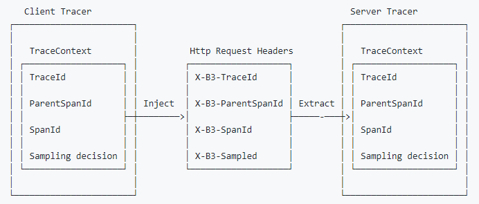
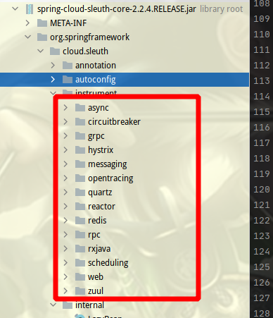
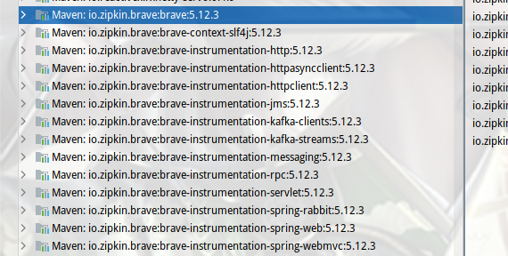

## 服务本身对traceId的处理

Sleuth通过Filter的方式，在filter中对请求头的处理来实现traceId的追踪。

先判断http头中是否存在“X-B3-TraceId”，不存在，则生成新的traceId；存在，则以头X-B3-TraceId的值作为traceId。
最后将X-B3-TraceId的值放到MDC中，以便日志输出中带上X-B3-TraceId。这样使得在本服务中，用户请求产生的日志输出都会带有traceId。

## 服务间对traceId的处理

在微服务中，服务A向服务B发起调用请求。那如何将A中的traceId传递给B呢？首先，先要了解服务A是如何调用服务B的。

### 1、网关接收到进行，进行请求转发

* 网关（gateway）`TraceWebFilter`

*  网关（zuul）ZuulFilter（`TracePostZuulFilter`）中将traceId添加到http头X-B3-TraceId中，以便所转发请求对应的服务能从头中获取到traceId。
同时还将traceId放到MDC中，以便本应用在输出日志时带traceId。

### 2、服务内部通过feign注解调用另一个服务

由于feign注解的实现是通过生成Hystrix的代理类来完成请求的处理，而Hystrix在进行请求发送时是通过异步的方式调用ribbon的组件进行负载均衡，
然后通过Feign.Client的execute方法来进行请求的发送。

故此时需要解决以下两个问题：

* （1）如何在异步线程中传递traceId。

Sluth是通过实现HystrixConcurrencyStrategy接口来解决traceId异步传递的问题。
Hystrix在实际调用时，会调用HystrixConcurrencyStrategy的wrapCallable方法。
因此，通过实现这个接口，在wrapCallable中将traceId存放起来（具体参见`SleuthHystrixConcurrencyStrategy`）。

* （2）Feign如何在服务中传递traceId。

 Sluth通过实现Feign.Client，在execute前将traceId存放到X-B3-TraceId头中来实现（具体参见`TraceFeignClient`）。

## Sleuth 支持可追踪的组件

包含：

